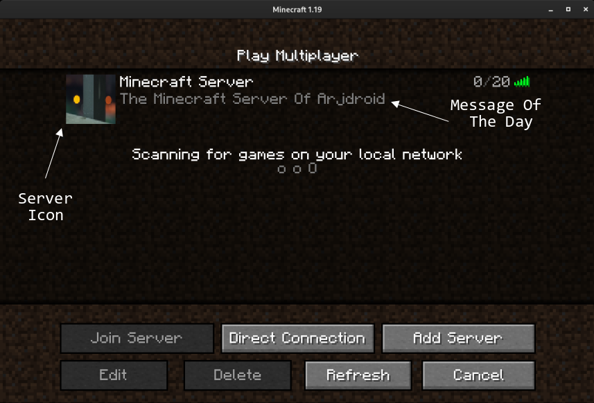

+++
draft = "false"
author = "Arjdroid"
title = "Hosting my own Minecraft Server with Docker on Linux"
date = "2022-06-09"
description = "An article that details how I hosted my own Minecraft Server using the Docker Engine."
tags = [
    "minecraft",
    "gaming",
    "networking",
    "homelab",
]
categories = [
    "gaming",
    "homelab",
    "networking",
]
series = ["Networking"]
aliases = ["Minecraft-Server"]
image = "minecraft-server.png"
+++

> **Disclaimer**: This guide is a general overview, please also do additional research before following. If you plan on using this article as a guide for setting up your OWN Minecraft (Java Edition) server, **PLEASE** read the entire article before going through with this process (It may help clear any doubts you have as well as ensure that you can go through with this process). Also, do remember that **I AM NOT RESPONSIBLE** for any damage that YOU may cause to yourself or your own hardware including, but not limited to: bricked devices, dead SD cards, thermonuclear war, or you getting fired because the alarm app failed. YOU are choosing to make these modifications, and I provide no guarantees of any sort.
>
> Also, you might want to zoom in / out to adjust the webpage to your liking.
>
> ### _**This guide is slightly advanced and not recommended to blindly follow especially for those unfamiliar with using Linux but please feel free to go over it**_

## Introduction

The idea of running my own Minecraft server for me and my friends first came to me after watching countless online videos of people playing on Minecraft SMP's (Survival-Multiplayer), I wanted to be able to collaborate with my friends on glorious builds and finding boatloads of diamonds (to turn into netherite of course).

There are a lot of different Minecraft server hosting options, some even being free of cost, but the free ones did not provide the best experience, though one can't really complain when it's free…

I wanted a better experience, with more fine-tuned control over the settings and better server performance. Although, this is much more advanced than using a paid, dedicated Minecraft hosting service.

## Prerequisites
 * A usable server (basically any computer, from a desktop to a laptop to a Raspberry Pi, a [Virtual Machine](https://en.wikipedia.org/wiki/Virtual_machine), or a cloud server on something like *Google Cloud Platform*)
 * Decent Specifications (to handle around 5 simultaneous players):
   * At least a dual core 64bit processor (any modern Intel Core CPU or AMD Ryzen CPU), or a Raspberry 4 (I'm not sure how well a 3 would hold up)
   * As much RAM as possible, at least 4GB, more is preferred
   * At LEAST 8GB of *free storage*
 * Any Linux distro (Ubuntu Server is very usable or Raspberry Pi OS Lite if you're on a Pi)
 * A valid Minecraft Java Edition Licence (to be able to play on your server!)
 * Being comfortable with a Linux environment and having basic troubleshooting capability and computer knowledge

I myself will be using a dual core (multi-threaded) amd64 virtual machine with 8GB of RAM assigned to it, running the server Linux distro Ubuntu. (If you use a distribution such as Arch Linux or Fedora or CentOS or OpenSUSE, the package commands / availability will be quite different for you although you already know that)

### This guide assumes a few more things
* That you have already installed and setup your Linux distribution upon your server, whatever it may be
* That your server is connected to the internet and up-to-date
* That you have access to its command line (either via SSH or via a keyboard + monitor)

 > **If you have not set up a Linux distribution on your server yet, you will need to do so**
 >
 > Usually it is a very straightforward installation process. I would recommend using the linux distribution Ubuntu Server as it is quite popular and has good support from forums to help with issues.
 >
 > You can follow Ubuntu's official installation documentation at https://ubuntu.com/tutorials/install-ubuntu-server
 >
 > I am using **Ubuntu 20.04 LTS**. You may choose to use Ubuntu 22.04 LTS which is newer although, at the time of writing I have found there may be some software that is not yet updated to be fully compatible with it but it is 75% likely to have been resolved by now.

## Docker Engine Setup

If you already have Docker installed on your system, please skip ahead to the next section, "Minecraft Server Docker Container Setup"

### Intro To Docker

We will be using the [containerization](https://www.ibm.com/cloud/learn/containerization) engine known as Docker, this allows us to separate the application (Minecraft Server) from the rest of your host operating system, making the application more portable (the environment is identical in each and every docker copy of a container) and possibly more secure by isolating the application from the rest of the system as well as greatly easing the installation process.

I prefer using Docker Containers over using native applications in server environments because it is generally more easy to maintain a Docker container as everything is neatly kept inside its little software box. It reduces the messiness of my server as I don't have to worry about random dotfiles in my home and config directories. It also makes the uninstallation process more painless as there will be less files to account for that might go missing.

Docker Containers also reduce attack surface area, meaning that they generally improve the security of your server. This is because Docker Containers by their nature isolate the application you are running so it reduces the chance of a vulnerability within the application in your Docker Container affecting data in the host server and vice versa.

Most serious and worthwhile server applications these days are available by their developers as a Docker Container. It is an industry standard especially in enterprise applications.

### Docker Install Instructions

Installing Docker is very simple, simply follow the instructions laid out at [https://docs.docker.com/engine/install/](https://docs.docker.com/engine/install/). It has instructions for all certified compatible systems. Just look at the table they give, and click on the tick-mark ✔️ which corresponds to your system. For my example, I'd click on the tick for "Ubuntu x86_64/amd64".

> I am including the instructions for my specific configuration (Ubuntu 20.04 LTS on amd64) . It may differ from the instructions you require, so please check the [official documentation](https://docs.docker.com/engine/install/) to be sure. As always, read instructions CAREFULLY before following!
> #### Sidenote: Docker officially support use on the following Linux Distributions
>  * Ubuntu / Debian (x86_64, arm64)
>  * Fedora / RHEL (x86_64, arm64)
>  * Raspbian (arm32-bit, and the new arm64 OS as well)
>  * CentOS (x86_64, arm64)
>  * If you are using Arch Linux, you should follow the [Arch Wiki guide to using Docker](https://wiki.archlinux.org/title/Docker) as it is not officially supported by Docker, but community maintained.

The button leads to a webpage containing all necessary instructions such as uninstalling any old versions present:

```sh
sudo a remove docker docker-engine docker.io containerd runc
```

It is most likely that, as you are on a fresh install, apt-get will report that none of these packages are installed or even been heard of (in its default repositories).

I will be following Docker's recommended method of installation, which is to configure apt (Ubuntu's package manager) to use Docker's private repositories for easily manageable installs, there are other, more advanced methods which may suit specific needs, but for our purposes, this method is the simplest.

To copy commands quickly you can double click the command to select the full line before pressing CTRL + C (or Command + C) to copy the line.

First we must update our package repositories:

```sh
sudo apt update
```

Then install some dependencies required for adding Docker's repositories.

```sh
sudo apt install ca-certificates curl gnupg lsb-release
```

After that you have to actually add Docker's official GPG key (used to verify Docker's repository) to Ubuntu Server's keyring:

```sh
curl -fsSL https://download.docker.com/linux/ubuntu/gpg | sudo gpg --dearmor -o /usr/share/keyrings/docker-archive-keyring.gpg
```

Then you need to choose which Docker repository you are going to add, in this case I'm choosing __stable__ which is almost always the desired option.

```sh
echo "deb [arch=$(dpkg --print-architecture) signed-by=/usr/share/keyrings/docker-archive-keyring.gpg] https://download.docker.com/linux/ubuntu $(lsb_release -cs) stable" | sudo tee /etc/apt/sources.list.d/docker.list > /dev/null
```

Then, to actually install the latest version of Docker Engine, you need to update your repositories:

```sh
sudo apt update
```

Then install the following packages:

```sh
sudo apt install docker-ce docker-ce-cli containerd.io
```

To verify that Docker Engine is installed correctly, run the __hello-world__ image:

```sh
sudo docker run hello-world
```

It should give an output similar to this:

```sh
Hello from Docker!
This message shows that your installation appears to be working correctly.

To generate this message, Docker took the following steps:
 1. The Docker client contacted the Docker daemon.
 2. The Docker daemon pulled the "hello-world" image from the Docker Hub.
    (amd64)
 3. The Docker daemon created a new container from that image which runs the
    executable that produces the output you are currently reading.
 4. The Docker daemon streamed that output to the Docker client, which sent it
    to your terminal.

To try something more ambitious, you can run an Ubuntu container with:
 $ docker run -it ubuntu bash

Share images, automate workflows, and more with a free Docker ID:
 https://hub.docker.com/

For more examples and ideas, visit:
 https://docs.docker.com/get-started/
```

You can try out its advise to run a proper Ubuntu container as well with the command `sudo docker run -it ubuntu bash` though keep in mind that this will eat up a couple of gigabytes of valuable storage because it creates a new docker container and it downloads the ubuntu image from docker's hub.

> ### Tip:
>
> You can delete old containers and images that you are no longer using via the following commands:
> To delete an old container you must first know the name or the id of the container
> ```sh
> $ sudo docker container ls -a
> CONTAINER ID   IMAGE         COMMAND    CREATED         STATUS                     PORTS   NAMES
> aaa7aab55ac1   hello-world   "/hello"   5 minutes ago   Exited (0) 5 minutes ago           eager_haibt
> 5f4294d34628   ubuntu        "bash"     4 minutes ago   Exited (0) 4 minutes ago           modest_banzai
> ```
> Suppose I want to delete the ubuntu container for whatever reason, I simply have to execute the following command:
> ```sh
> sudo docker rmi aaa7aab55ac1
> ```
>
> You can replace the container ID with that of whichever container you want to delete
> For more information you should check out the Docker documentation at https://docs.docker.com/

You should also install the `docker-compose-plugin` in case it was not already installed:
```sh
sudo apt install docker-compose-plugin
```
This is an optional add-on for Docker which can again improve how well your containers are organised and I am covering it in the next section.

## Minecraft Server Docker Container Setup

Now that we have Docker up and running, we can explore different options as to how we go about setting up the Minecraft server Docker container.

I have found that the project at https://github.com/itzg/docker-minecraft-server is a great starting place and it is what I will be using in this guide.
> You may want to use a different docker container such as https://github.com/itzg/docker-minecraft-bedrock-server in case you and your friends play on Minecraft: Bedrock Edition (Windows 10 Edition, and all the Mobile / Console editions are bedrock) although they won't be addressed much here.

The first thing you may want to do is to download the latest image of itzg/minecraft-server [(available from Docker Hub)](https://hub.docker.com/r/itzg/minecraft-server) by doing
```sh
sudo docker pull itzg/minecraft-server:latest
```
Then you want to create a folder which will contain all of the configuration files specific to your server. Make sure to remember (write down / document) where you keep this folder as it is important for actually running the Minecraft server.

Usually it is a good idea to keep that folder in your home directory which is at `/home/username` depending on your username. A universal shortcut for your current user's home directory is `~` and when you login to your user you are by default, in your home directory.

Check your current directory (on Ubuntu's bash cmd your directory is listed next to your username but you can use the `pwd` command to see it as well)
```sh
user@minecraft-server:~/$ pwd
/home/user/
```
Create your folder
```sh
mkdir minecraft-server
```
Check that the folder exists with the `ls` command
```sh
user@minecraft-server:~/$ ls
minecraft-server
```
Then you can enter the directory
```sh
cd ./minecraft-server/
```

There are two ways (that I know of) to provision a docker container.
1) Use a command with arguments for each configuration of the container
2) Use a `docker-compose.yml` file

There are advantages and disadvantages to both.

For example, commands are very quick to use and are good for running one-off, disposable docker containers to test things. One example is
```sh
sudo docker run hello-world
```
It is a short, straightforward command to test the hello-world container. You can add arguments to do things like attach network ports and data volumes and specify executing specific commands. You can also put all those things in a shell script such as `docker-hello-world.sh` which will contain the command along with its arguments so that you can run it with just one executable.

The main drawback however, at least in my opinion, is readability and editability. It can be hard to easily dissect and understand a large, single command script with many arguments. Even a well made command like the one below still needs to use backslashes which could be easily messed up.
```sh
docker run -d \
 --name jellyfin \
 --user uid:gid \
 --net=host \
 --volume /path/to/config:/config \
 --volume /path/to/cache:/cache \
 --mount type=bind,source=/path/to/media,target=/media \
 --restart=unless-stopped \
 jellyfin/jellyfin
```

A much more elegant solution, in my opinion, is [Docker Compose](https://docs.docker.com/compose/) which allows you to put all of your arguments into a `docker-compose.yml` file (using the [YAML](https://en.wikipedia.org/wiki/YAML) file format which can be edited in plain text editors).

Here is a `docker-compose.yml` file which does the same as the script above (running a basic [Jellyfin](https://jellyfin.org/) Docker container which is a self-hosted Streaming Service)
```yml
version: "3.5"
services:
  jellyfin:
    image: jellyfin/jellyfin
    container_name: jellyfin
    user: uid:gid
    network_mode: "host"
    volumes:
      - /path/to/config:/config
      - /path/to/cache:/cache
      - /path/to/media:/media
      - /path/to/media2:/media2:ro
    restart: "unless-stopped"
    # Optional - alternative address used for autodiscovery
    environment:
      - JELLYFIN_PublishedServerUrl=http://example.com
```
Sure, the file is bigger, but it is easier now for a human to read it and understand what it does. You can edit different options more confidently as the syntax is also more obvious.

I will be using Docker Compose for the Minecraft server.

The `docker-compose.yml` file for the default configuration of the server is
```yml
version: "3"

services:
  mc:
    image: itzg/minecraft-server
    ports:
      - 25565:25565
    environment:
      EULA: "TRUE"
    tty: true
    stdin_open: true
    restart: unless-stopped
```

This is just the base, and we can add a lot more arguments which can improve the server.

#### Add a Message Of The Day (MOTD)
This shows up as the server description in the Minecraft Client's server view so it's a good thing to have to easily identify your server.
#### Server Icon (ICON)
This is a URL to an icon image, it can be whatever you choose as it will automatically convert the image to the right size and format to be shown in the Minecraft Client.



#### Timezone (TZ)
This is the timezone of your server which is applied to the time that is used in your logs, make sure that your host system's timezone is the same as that of the Docker container.
#### Whitelist Players (WHITELIST)
This is a pretty important security feature, you can make a list of players who are allowed to join your server which can prevent random unknown griefers from coming and destroying your server. It also makes it easy to quickly add and remove allowed players.
#### Administrator Players (OPS)
This is a list of players who have admin powers over the server, this means that they can have cheats and can ban or kick players.
#### Difficulty (DIFFICULTY)
You can hard code the Difficulty of the server, I would probably set it to hard so that you can infect / cure zombie villagers with a 100% success rate but you can choose whatever difficulty (peaceful, easy, normal, hard) you like.
#### Maximum Number of Players (MAX_PLAYERS)
You can set this to ensure your server / network connection is not overloaded with too many players, by default the number is 20 although that may be too many for your server to handle.
#### View Distance (VIEW_DISTANCE)
This affects the maximum render distance a client can have, higher numbers are going to be very, very intensive, especially if there are many players. This setting depends on your specs, but you should test different render distances at increments of 4. The max I'd say a client would reasonably want is 20 and see if the server struggles. If it does, go down to 16, then 12, then 8 and vice versa.
#### Player Vs Player Combat (PVP)
PVP is enabled by default, this may be a bit chaotic or against the values of your Minecraft server so you can disable it.

### Data Volumes
Docker has a feature in which containers can store data in a "Volume". This volume is a part of the host's native file system. In the example below, there is a volume attached called `minecraft-data`. This will create a directory called `minecraft-data` under the directory in which the `docker-compose.yml` file is stored. In my case the path of the directory will be `~/minecraft-server/minecraft-data`. This same directory is perceived to be the `/data` directory to the image inside of the Docker container.

The purpose of doing this is so that I can easily access the data of the minecraft-server in that directory natively from my host OS so that I can run regular backups and do other things. It allows me to easily extract data like the actual Minecraft world of the server and transfer it to a new docker container. It is also useful when updating the Docker image of itzg/minecraft-server so that the world is persistent throughout newer versions of the image.

A deeper and easier to understand explanation is available at https://docs.docker.com/storage/volumes/

### Final `docker-compose.yml` File
Here is what a `docker-compose.yml` file with all of these options configured can look like
```yml
version: "3"

services:
  mc:
    image: itzg/minecraft-server
    ports:
      - 25565:25565
    environment:
      EULA: "TRUE"
      MOTD: "The Minecraft Server Of Arjdroid"
      ICON: "https://github.com/Arjdroid/arjdroid.github.io/blob/main/image/P1181064.JPG"
      TZ: "Europe/London"
      WHITELIST: "Arjdroid"
      OPS: "Arjdroid"
      DIFFICULTY: "hard"
      MAX_PLAYERS: "50"
      VIEW_DISTANCE: "16"
      PVP: "false"
    tty: true
    stdin_open: true
    restart: unless-stopped
    volumes:
      # attach a directory relative to the directory containing this docker-compose.yml file
      - ./minecraft-data:/data
```

There are other options available as well but these are the ones I thought most important, you can check out the full list on the docker-minecraft-server github page https://github.com/itzg/docker-minecraft-server and scroll down.

You can test the configuration by running the docker container (while in the same directory as the `docker-compose.yml` file.
```
user@minecraft-server:~/minecraft-server$ sudo docker compose up
```

Now you need to add the server in your Minecraft client. You can go to the "Multiplayer" section of the Minecraft client, and then click the "Add Server" button. You can give the server whatever name you want.

The "Server Address" section is quite important. You need to know the IP Address (or URL) of the host server in which you are running the Docker Minecraft Server. If it is a public cloud virtual machine then it will have a public IP that you should already know.

For example, if your server has the public IP address 123.123.123.123. You need to enter 123.123.123.123 (This is assuming that you have set the Minecraft server's port to 25565 in the `docker-compose.yml` which is the default). If your server has a domain name such as example.net then you can enter that as the "Server Address".

If you are running the server on a computer on your local LAN, then for now, for testing purposes, you can use its local IP address which you need to find using your router settings or a command like `ifconfig` or `ip a` and usually the IP address will be 192.168.1.x. Your network may also have an internal DNS server (like Pi-Hole) which can assign individual, local, domain names to each and every computer on the network.

If you are running the docker-minecraft-server on your own computer, you can simply type `localhost` into the "Server Address" section.

Now you can test your Minecraft server by joining it through your Minecraft client and doing whatever you want and you can alter the settings as well.

## Networking Setup (Port Forwarding)

There is an additional step required to actually make your Minecraft Server accessible to the world if it is currently only accessible via a local IP address. You need to enable a network setting on your router called "Port Forwarding".

This will allow people from outside your network to access the specific port 25565 on your local minecraft server.

### Keep in mind that this can also open up your network to attacks from outside
**You do this at your own risk and this is not recommended to inexperienced network administrators.**

You need to know what model is your router and look up the instructions to set up port forwarding on that specific router. The port you are forwarding is 25565 and the IP address will be the local IP address of the Minecraft server. 

More detailed instructions will require knowledge of your specific setup. I trust that your abilities to use a search engine will suffice in getting you there.

With that, I think you have the knowledge you need to get started as a Minecraft server administrator.

> Thank you for reading!